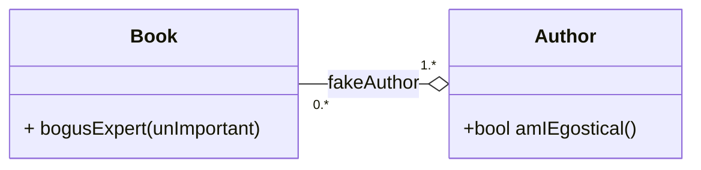

```mermaid
classDiagram
    direction RL
    %% Links follow
    Author "1.*" o-- "0.*" Book : fakeAuthor
    class Author { 
        +bool amIEgostical()
    }
    class Book { 
        + bogusExpert(unImportant)
    }
```
