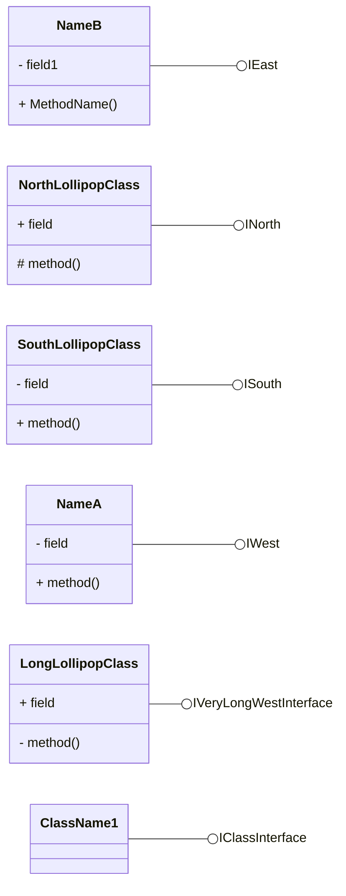

```mermaid
classDiagram
    direction RL
    %% Links follow
    IEast ()-- NameB 
    INorth ()-- NorthLollipopClass 
    ISouth ()-- SouthLollipopClass 
    IWest ()-- NameA 
    IVeryLongWestInterface ()-- LongLollipopClass 
    IClassInterface ()-- ClassName1 
    class NameB { 
        - field1
        + MethodName()
    }
    class NorthLollipopClass { 
        + field
        # method()
    }
    class NameA { 
        - field
        + method()
    }
    class SouthLollipopClass { 
        - field
        + method()
    }
    class LongLollipopClass { 
        + field
        - method()
    }
    class ClassName1 { 
    }
```
