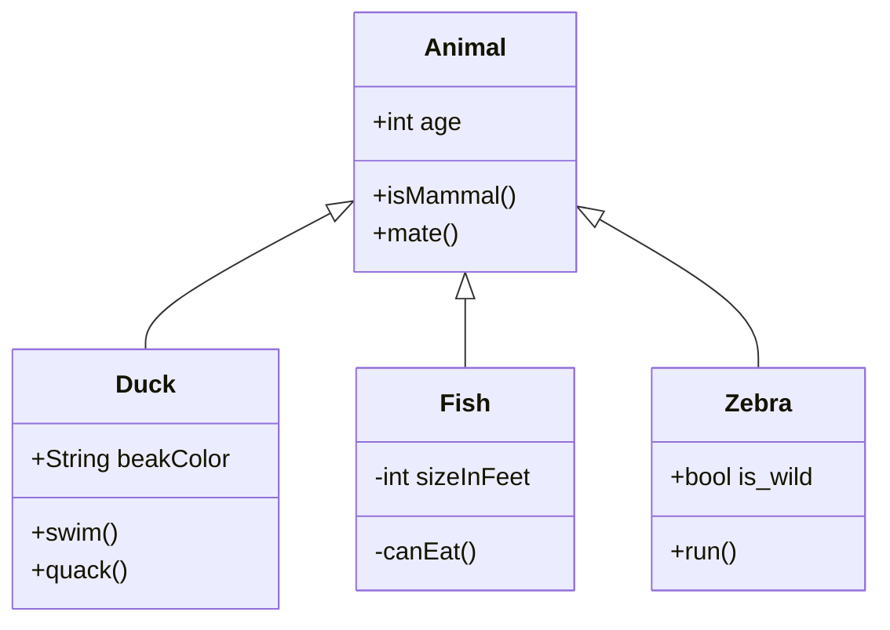

```mermaid
classDiagram
 
    %% Note not supported until 9.3.0 Pycharm is on 9.1.3 and Typora is on 9.1.2
    Animal <|-- Duck
    %% note for Duck "can fly\n can swim\n can dive\n can help in debugging"
    Animal <|-- Fish
    Animal <|-- Zebra
    class Animal {
        +int age
        +isMammal()
        +mate()
    }
    class Duck {
        +String beakColor
        +swim()
        +quack()
    }
    class Fish {
        -int sizeInFeet
        -canEat()
    }
    class Zebra {
        +bool is_wild
        +run()
    }
```
