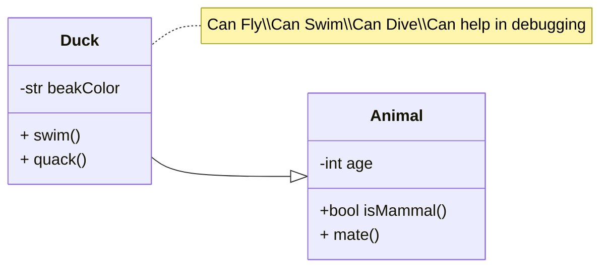

```mermaid
classDiagram
    direction RL
    %% Links follow
    Animal<|--Duck
    note for Duck "Can Fly\\\\Can Swim\\\\Can Dive\\\\Can help in debugging"
    class Animal { 
        -int age
        +bool isMammal()
        + mate()
    }
    class Duck { 
        -str beakColor
        + swim()
        + quack()
    }
```
