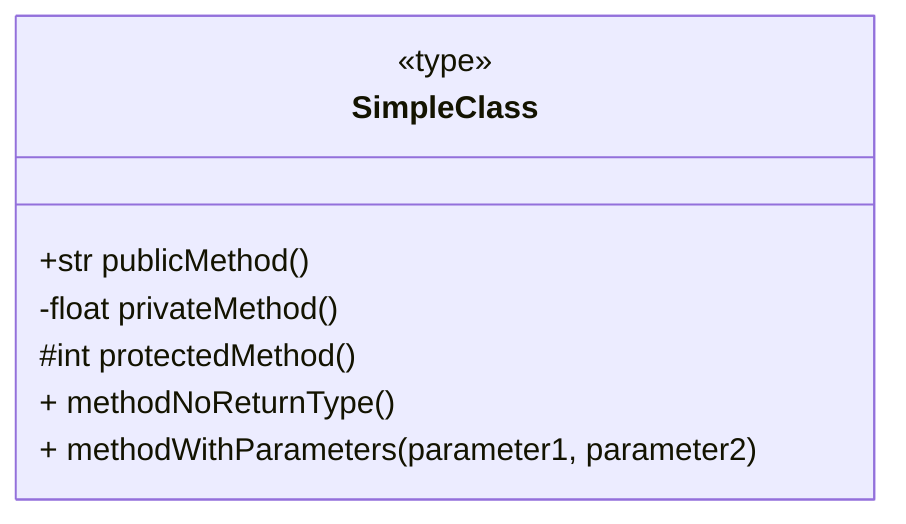

```mermaid
classDiagram
    class SimpleClass { 
        <<type>>
        +str publicMethod()
        -float privateMethod()
        #int protectedMethod()
        + methodNoReturnType()
        + methodWithParameters(parameter1, parameter2)
}
```

